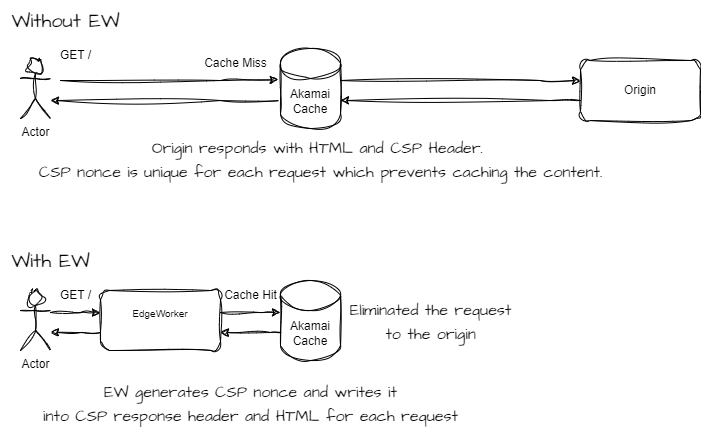

# EdgeWorkers CSP: Cutting Latency, Not Security

### Resources:
See the full writeup and explanation at [Akamai EdgeWorker Techdocs](techdocs.akamai.com/edgeworkers/docs/content-security-policy) for additional guidance.

### Proposed Solution:


Implementing the dynamic CSP nonce at the Edge with EdgeWorkers can provide significant advantages. Nonce generation and insertion server-side can be difficult to do and can impact performance. Let's delve into some reasons why this approach is advantageous:

1. Reduced Latency:
Generating nonces with EdgeWorkers offers a solution that eliminates the need for high-latency calls to the origin server. This is achieved by dynamically generating and embedding nonces into cached content, a process that traditionally posed challenges due to the requirement that the CSP be unique for each request.
With EdgeWorkers, we can overcome this challenge by generating and embedding nonces into cached content at the Edge for every request. This serverless and distributed approach ensures that CSPs are served from edge locations in close geographical proximity to users. Furthermore, EdgeWorkers abstracts the underlying infrastructure, providing a scalable environment for CSP processing that operates independently of the primary application servers.
2. Distributed Security:
By implementing CSP nonce generation at the edge, you establish an additional layer of security distinct from the application code. In the event of application vulnerabilities, the CSP EdgeWorker can help mitigate risks before requests even reach your end users, providing an added layer of defense. 
3. Ease of Maintenance:
Managing the dynamic nonce for the CSP at the edge with a serverless approach simplifies maintenance tasks. You can centrally update CSP policies at the edge without modifying the application code itself. This reduces deployment complexities and the likelihood of introducing bugs. Additionally, using EdgeWorkers provides a central point of control for multiple independent applications developed by different teams governed by a single consistent EdgeWorker applied across all applications.

### HTML and HTTP Response Headers BEFORE the EdgeWorker runs:
```
Content-Security-Policy: default-src ’self;script-src 'nonce-replaceWithGeneratedNonceForEveryRequest';worker-src 'none';obiect-src \*;style-src 'self' 'unsafe-inline'; ….

<script nonce="nonce-replaceWithGeneratedNonceForEveryRequest">
    document.getElementById("example").innerHTML = "This content was inserted using an inline script";
</script>
<script type=‘module" src="script.js" nonce="nonce-replaceWithGeneratedNonceForEveryRequest"></script>

```

### HTML and HTTP Response Headers AFTER the EdgeWorker runs:
```
Content-Security-Policy: default-src 'self';script-src 'nonce-Mzky0TklNzclOQ==';worker-src 'none';object-src. \*;style-src 'self' 'unsafe-inline'; …

<script nonce= "Mzky0TklNzclOQ--">
    document.getElementById("example’').innerHTML = "This content was inserted using an inline script";
</script>
<script type='module' src="script.js" nonce=’MzkyQTklNzclOQ--’></script>
```