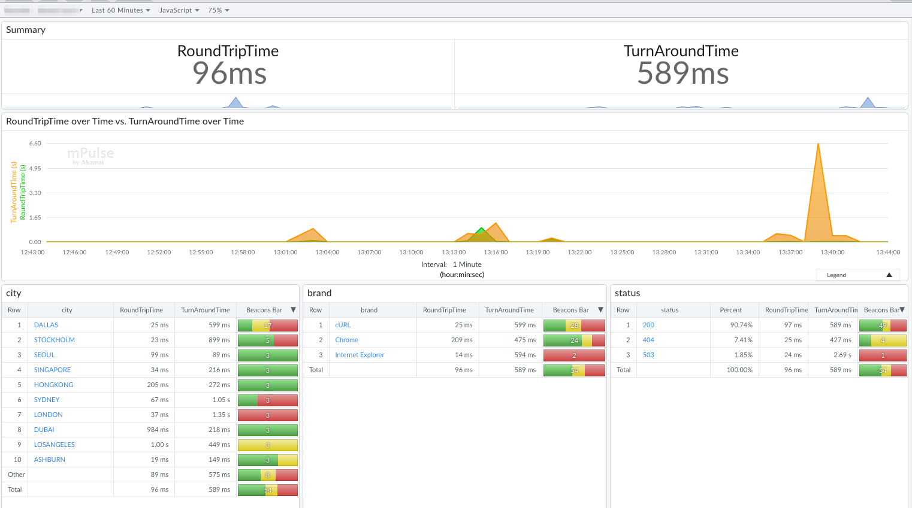

# mPulse-integration

*Keyword(s):* tracking, mpulse, monitoring, visitor 
*[Since](https://learn.akamai.com/en-us/webhelp/edgeworkers/edgeworkers-user-guide/GUID-14077BCA-0D9F-422C-8273-2F3E37339D5B.html):* 1.0

This example will send a mPulse beacon to visualize the number of hits and custom data, such as the EdgeWorker's User Location Object, Device Object, HTTP Status Code, and custom timers with PM Variables on the mPulse dashboard in near real-time.

## Usage Examples

    GET /api/service/endpoint
    (mPulse beacon will send with City, Brand name of Device, HTTP Status Code, and Performance Timers)

## mPulse Dashboard

## Tip
mPulse Enterprise is required to use this
 
## More details on mPulse
- [Akamai mPulse](https://techdocs.akamai.com/mpulse/docs/welcome-to-mpulse)
- [Akamai mPulse Beacons](https://techdocs.akamai.com/mpulse/reference/beacons)

## Resources
See the repo [README](https://github.com/akamai/edgeworkers-examples#Resources) for additional guidance.