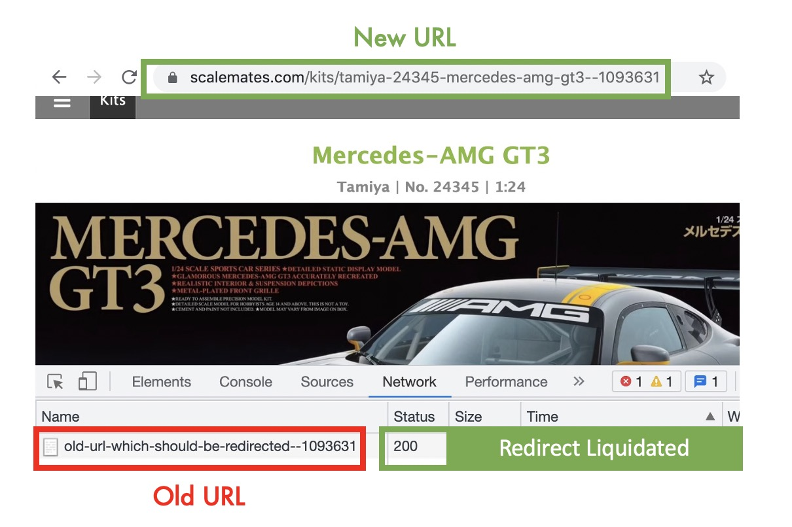
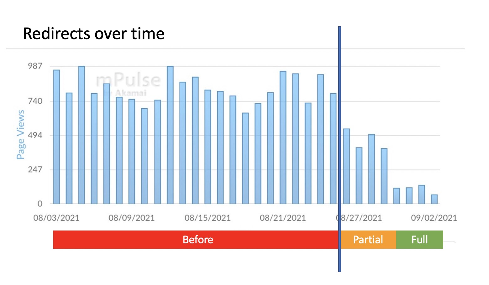
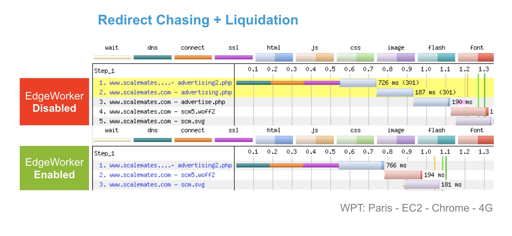

# RedirectLiquidator
A performance focussed EdgeWorker. Silently chase `301/302` redirects and transform them into a single `200` response at the Edge.

The benifits of this approach are
* No redirect
* New content
* Updated URL

## What is Redirect Liquidation
Instead of serving a response with a `301/302` redirect we directly serve the actual content (`200`) and inject 1 extra line of JavaScript in the <head> section. 

``
  

This JS snippet updates the original URL without triggering a redirect. This is done using the `history.replaceState` method from the [History API](https://developer.mozilla.org/en-US/docs/Web/API/History/replaceState). The History API is well supported with an adoption rate of 96%+.
  

  
## Implementation
  
From a high level perspective the EgdeWorkers does 3 steps:
* Manages super fast redirects at the Edge and chases redirects from the origin
* Injects `<history.replaceState>` in the response body 
* Sends a 200 response to the end-user
  
### find-replace-stream.js Library
We build on top of the ready to use [find-replace-stream library](https://github.com/akamai/edgeworkers-examples/tree/master/edgeworkers/libraries/find-replace-stream) available on Github. This allows us to search for a tag (eg. </title>)  and append it with the history.replaceState() JavaScript method.

`import { FindAndReplaceStream } from 'find-replace-stream.js';`

Make sure the find-replace-stream.js is part of your bundle.
  
### bundle-redirect-liquidation.tgz
A [ready to use code bundle](bundle-redirect-liquidation.tgz) can be imported via the CLI or the UI 

### Configuration Options
  
* `REDIRECT_CODES;`: Configure for which response codes you enable Redirect Liquidation. _Default value is `[301,302,303,307,308]`_
* `INJECT_AFTER_TAG`: Configure where in the HTML the JS snippet is injected. _Default value is `</title>`_

### getRedirectLocationFromEdge()
A hook to implement redirect logic at the Edge. This optional method allows you to manage redirect logic at the Edge. It is up to you to implement this logic inside your bundle, by loading redirect instructions from an API call or from EdgeKV.

### Disable for bots

This feature should not be enabled for bots (eg. Google Crawler). When a bot crawls an outdated link they must receive the original 301/302 response.
This can be done based on User Agent matching or more correctly using Botman and the technique [described here](https://developer.akamai.com/blog/2020/02/25/improve-performance-and-seo-tuning-crawlers).

### Scoping?
Use Property Manager criteria (UI or API) to limit this EdgeWorker to only run on HTML pages.

## Result
  
This mPulse RUM graph shows the amount of pages having a redirect penalty over time. In the last 4 days a significant drop is visilbe. This is when the above solution rolled out entirely.

This screenshot from WebPageTest (4G Connection) shows the result when for multiple chained redirects.

  
## Q&A
**Isn’t this the same as redirect chasing available in Property Manager?**
Redirect chasing is great, however the result is a `200` on the original URL. While this Redirect Liquidator also covers updating the URL in the browser.

**What is the difference with a forward rewrite?**
Forward rewrites are a perfect use case to serve content over a different URL. A forward rewrite returns a `200` but does not change the original URL seen by the enduser.

**Could you do this at the origin?**
Yes, this technique is not specific to Akamai EdgeWorkers. However depending on your CMS/Framework this might be too complex or not even possible at all.

**What happens when multiple redirects are sent**
Multiple redirects are recursively chased and and combined into a single `200` pointing to the latest URL.
