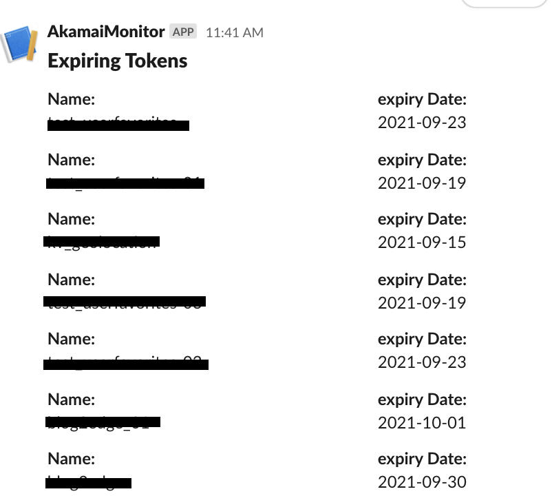

# Akamai EdgeKV Token Expiration monitor

As simple tool that monitors KV token expiration dates. This will allow one to be alerted in advance for upcoming token expiration


## Installation Instruction
### Pre-requisite
Please ensure you have satisfied the following pre-requisites:
* `Bash` shell installed on your system.
* `python3.9` or higher installed on your system.
* `pip3` installed on your system.
* `slack webhook` to the slack application 
   * https://api.slack.com/messaging/webhooks
* `Akamai API Credentials` to invoking the  EdgeKV (Service to read, write and configure EdgeKV to be used with Edgeworkers ) APIs with READ-WRITE permission
   * https://developer.akamai.com/legacy/introduction/Prov_Creds.html

### Install the necessary modules
To install necessary modules, execute:
```
$ pip3 install -r requirements.txt in your shell
```

### Setup the environment variables
Edit the file checkKVTokens.sh  and update the values of the following variables
- Akamai API Credentials for accesing EdgeKV APIs (Generated as mentioned above)
   - AKAMAI_CLIENT_SECRET
   - AKAMAI_API_HOST
   - AKAMAI_ACCESS_TOKEN
   - AKAMAI_CLIENT_TOKEN
- Slack web hook URL( Generated as mentioned above)
   - SLACK_WEB_HOOK
- LEAD_TIME ( default value 30 days)

### Run the script
```
sh ./checkKVTokens.sh
```

### Enable Debugging
To enable debugging add following environment variable to the checkKVTokens.sh file before the python command. This will log debug message in checkKVTokens.log file.
export DEBUG="True"

### Schedule the job using Jenkins
The python script can be invoked as a Jenkins job with the necessary parameters and secret texts. A regular schedule jpb will allow one to have slack notification sent when a token is coming up for expiration.

### Sample Output

