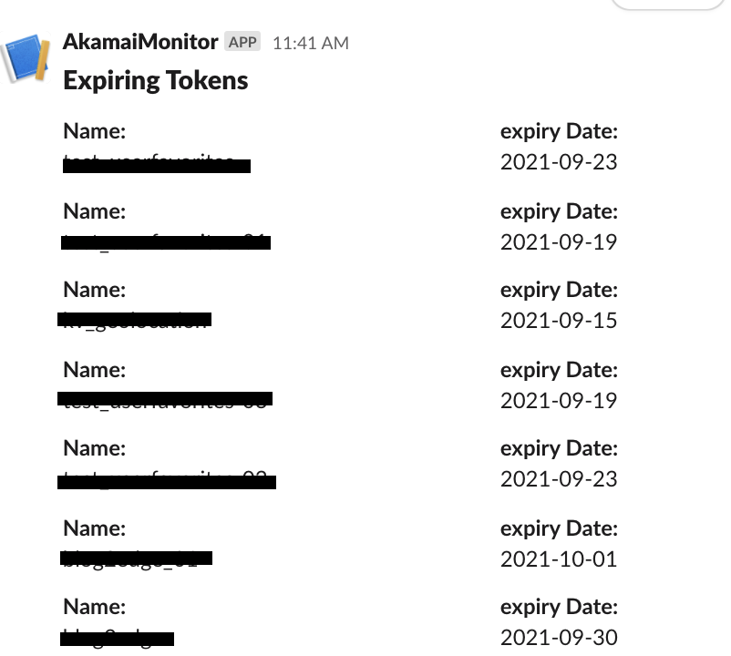

# Akamai EdgeKV Token Expiration monitor

As simple tool that monitors KV token expiration dates. This will allow one to be alerted in advance for upcoming token expiration


## Installation Instruction
### Pre-requisite
Please ensure you have satisfied the following pre-requisites:
* `Bash` shell installed on your system.
* `python3.9` or higher installed on your system.
* `pip3` installed on your system.
* `slack webhook` to the slack application 
   * https://api.slack.com/messaging/webhooks
* `Authentication credentials for Akamai APIs` to invoking the  EdgeKV (Service to read, write and configure EdgeKV to be used with Edgeworkers ) APIs with READ-WRITE permission
   * https://techdocs.akamai.com/developer/docs/edgegrid

### Install the necessary modules
To install necessary modules, execute the following:
```
$ pip3 install -r requirements.txt
```

### Setup the environment variables
Edit the file checkKVTokens.sh and update the value of the following variable:
- Slack web hook URL (Generated as mentioned above)
   - SLACK_WEB_HOOK

if you skip this step the tokens will be printed to the command line but not posted to Slack
### Run the script
```
sh ./checkKVTokens.sh [OPTIONS]
```

**Options:**

| Option | Default | Description |
|---|---|---|
| `--edgerc PATH` | `~/.edgerc` | Path to the Akamai `.edgerc` credentials file |
| `--section SECTION` | `default` | Section within the `.edgerc` file to use |
| `--lead_time DAYS` | `30` | Number of days before expiry to trigger an alert |

**Example:**
```
sh ./checkKVTokens.sh --edgerc ~/.edgerc --section default --lead_time 60
```

### Enable Debugging
To enable debugging, set the `DEBUG` environment variable before the script. Debug messages will also be written to `checkKVTokens.log`.
```
DEBUG=1 sh ./checkKVTokens.sh --edgerc ~/.edgerc --section default
```

### Schedule the job using Jenkins
The python script can be invoked as a Jenkins job with the necessary parameters and secret texts. A regular schedule jpb will allow one to have slack notification sent when a token is coming up for expiration.

### Sample Output

